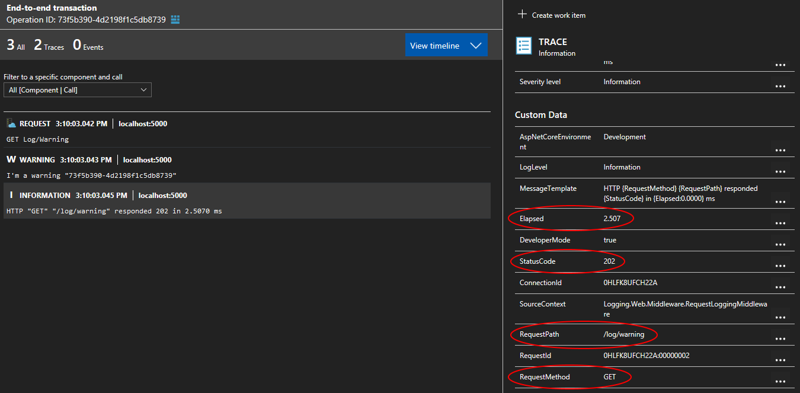
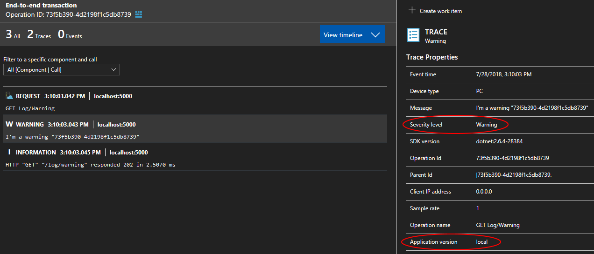
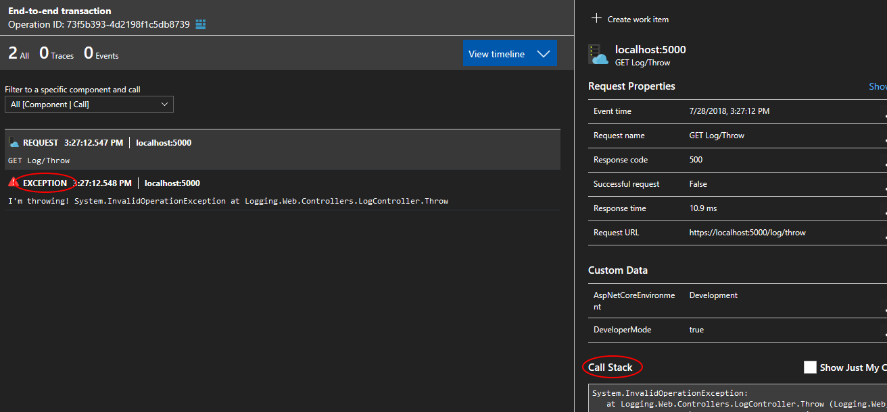
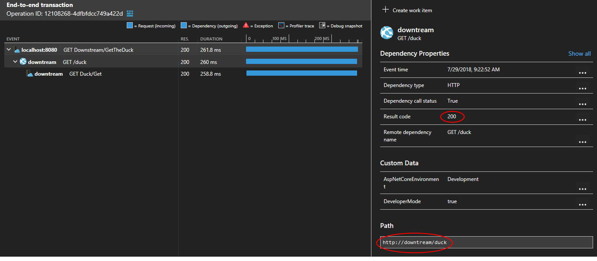
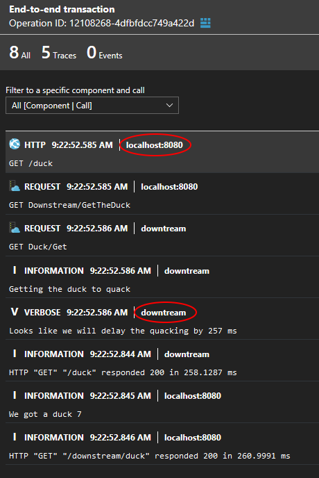
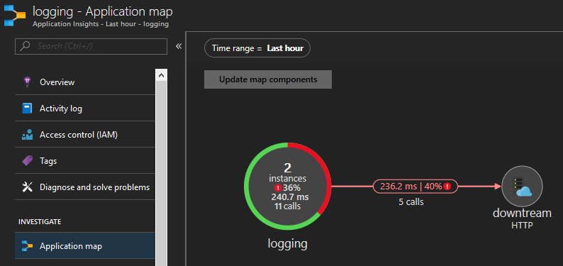

# ASP.NET Core + Serilog + Application Insights

I wanted to demonstrate the power of [structured logging][structured-logging] and illustrate some of the goodness of [Application Insights][application-insights] (such as [correlation across services][correlation] and [application map][application-map]).

## Contents

- [Application Insights configuration](#application-insights-configuration)
- [Enhance logging](#enhance-application-insights)
- [A demo running in Azure App Service](#azure)
- [A demo running locally](#locally)
- [Results in Application Insights portal](#results-in-application-insights-portal)

## CI / CD

[](https://dev.azure.com/gabrielweyer/AspNetCoreAppInsights/_build/latest?definitionId=13?branchName=master)

## Prerequisites

- [Create an Application Insights resource][create-application-insights]
- [Install .NET Core SDK 2.2.100][dotnet-core-sdk]
- [Install Docker][docker] (optional)

## Guiding principles

- Logging should be wired up as early as possible to capture startup issues
- Use `Microsoft.Extensions.Logging.ILogger<T>` instead of `Serilog.ILogger`

## Local configuration

To simplify the local configuration, I'm using the [Secret Manager][secret-manager]. I made it so that all applications share the same `UserSecretsId` (`b645d8b3-b7a2-436e-85af-6d8de9e23bfa`). If multiple applications rely on the same secret, you will only need to set this secret once.

To set a secret:

```posh
dotnet user-secrets --id b645d8b3-b7a2-436e-85af-6d8de9e23bfa set <secret-name> "<secret-value>"
```

## Application Insights instrumentation key

The `Application Insights` instrumentation key should be stored as a secret. When running locally you can leverage the `Secret Manager`.

**Beware**: the `Application Insights` instrumentation key cannot be rotated.

## Application Insights configuration

**Note**: this is based on the `NuGet` package [Microsoft.ApplicationInsights.AspNetCore][ai-nuget] `2.3.0`.

Some settings can be set via [ASP.NET Core configuration][aspnet-core-configuration] and code while others can only be set via code. If _known_ configuration keys are set they will take precedence over the _"normal"_ configuration keys. This section explains the convoluted default behaviour of `Application insights` while the next [section](#a-better-way-to-configure-application-insights) details what I think is a better approach.

| Code property name | Known configuration key | "Normal" configuration key |
| - | - | - |
| `AddAutoCollectedMetricExtractor` | N/A | N/A |
| `ApplicationVersion` | `version` | N/A |
| `DeveloperMode` | `APPINSIGHTS_DEVELOPER_MODE` | `ApplicationInsights:TelemetryChannel:DeveloperMode` |
| `EnableAdaptiveSampling` | N/A | N/A |
| `EnableAuthenticationTrackingJavaScript` | N/A | N/A |
| `EnableDebugLogger` | N/A | N/A |
| `EnableHeartbeat` | N/A | N/A |
| `EnableQuickPulseMetricStream` | N/A | N/A |
| `EndpointAddress` | `APPINSIGHTS_ENDPOINTADDRESS` | `ApplicationInsights:TelemetryChannel:EndpointAddress` |
| `InstrumentationKey` | `APPINSIGHTS_INSTRUMENTATIONKEY` | `ApplicationInsights:InstrumentationKey` |

### Most relevant settings

- `ApplicationVersion` will appear as `Application Version` in the Application Insights portal
  - Defaults to the value of the [entry assembly][entry-assembly]'s [VersionAttribute][version-attribute]  which has some fairly restrictive [rules][version-attribute-rules]
  - Even more relevant if you leverage [canary releases][canary-release] as you'll have two different versions of your application serving production traffic at the same time
- `DeveloperMode` will send data immediately, one telemetry item at a time. This reduces the amount of time between the moment when your application tracks telemetry and when it appears on the `Application Insights` portal
  - If a debugger is attached on process startup, the `SDK` will ignore the configuration keys related to `DeveloperMode` and turn it on
- `EnableAdaptiveSampling` affects the volume of telemetry sent from your web server app to the `Application Insights` service endpoint. The volume is adjusted automatically to keep within a specified maximum rate of traffic ([documentation][adaptive-sampling])
- `InstrumentationKey` self-explanatory

### A better way to configure Application Insights

The [most relevant settings](#most-relevant-settings) require to be configured via configuration **and** code. The process is cumbersome as:

- When using the configuration ([SDK source][configuration-via-configuration]), only some settings can be set; Namely: `ApplicationVersion`, `DeveloperMode`, `EndpointAddress` and `InstrumentationKey` ([SDK source][configuration-via-configuration-settings]). The notable absent here is `EnableAdaptiveSampling`.
- When using the code ([SDK source][configuration-via-code]), the `SDK` will instantiate its own `IConfiguration` ([SDK source][configuration-via-code-default]) using three providers: `appsettings.json`, `appsettings.{EnvironmentName}.json` and `environment variables`. If you're leveraging any other providers such as the `Secret Manager`, `Key Vault` or the `command line` they will be ignored. This will impact `InstrumentationKey` as it should be stored as a secret.

I wrote an [extension method](samples/Docker.Web/Extensions/ServiceCollectionExtensions.cs) that leverages both code and configuration and allows you to set the most relevant settings via configuration.

### Running on a non-Windows platform

`Application Insights` is persisting telemetry to a temporary directory so that it can retry sending them in case of failure. This works out of the box on `Windows` but requires some configuration on `macOS` and `Linux`:

- Create a directory to hold the telemetry
  - The user running `Kestrel` needs to have write access to this directory
- Set the configuration key `ApplicationInsights:TelemetryChannel:StorageFolder` with the path of the directory

## Enhance logging

### Request logging middleware

I disabled the built-in request logging by setting the `Microsoft` minimum level to `Warning` and replaced it by [RequestLoggingMiddleware](samples/Docker.Web/Middleware/RequestLoggingMiddleware.cs).

- Emit a single `Information` event when the request completes instead of two (one at the beginning and one at the end)
- Requests that throw an `Exception` or return a HTTP status code greater than `499` are logged as `Error`
  - Swallow the `Exception` to avoid duplicate logging of `Exception`

## Azure

This demonstrates the capabilities of `Application Insights` when used in an [Azure App Service][azure-app-service]. The application is composed of:

- A `Web App (ASP.NET Core 2.2)` `API`
- A `Web Job (.NET Core 2.2 console app)`
- An `Azure Service Bus` namespace with a topic and a subscription to allow the `Web App` to delegate some tasks to the `Web Job`

### Local secrets configuration

You'll need to configure the following secrets when running locally:

- `Jwt:SecretKey` - used to sign the `JWT`, should be at least `16` characters
- `ServiceBus:ConnectionString`
- `APPINSIGHTS_INSTRUMENTATIONKEY`

### Deploy the infrastructure

```posh
cd .\template\
.\deploy.ps1 -subscriptionId <subscription-id> -resourceGroupName <resource-group-name> -resourceGroupLocation <resource-group-location>
```

This will create the resource group if it does not exist and:

- Application Insights
- An Azure Service Bus namespace with a topic and a subscription
- App Service
- Web App
  - The Application Insights instrumentation key will be configured as an app settings
  - The Topic Sender SAS connection string will be configured as an app settings
  - PHP will be turned off
  - Will use the 64 bit platform
  - ARR will be turned off

Alternatively you can [sign-in to Azure][sign-in-azure] and [test the deployment][test-deployment]. Execute the commands line by line:

```posh
Login-AzureRmAccount
Get-AzureRMSubscription
Set-AzureRmContext -SubscriptionID <subscription-id>
# Either test the deployment:
Test-AzureRmResourceGroupDeployment -ResourceGroupName "<resource-group-name>" -TemplateFile .\template.json -TemplateParameterFile .\parameters.json
# Or deploy it:
New-AzureRmResourceGroupDeployment -ResourceGroupName "<resource-group-name>" -TemplateFile .\template.json -TemplateParameterFile .\parameters.json
```

## Locally

This demonstrates the capabilities of `Application Insights` when running locally (optionally inside `Docker`). The application is composed of:

- An _upstream_ (client-facing) `ASP.NET Core 2.2` `API`
- A _downstream_ (called by the _upstream_) `ASP.NET Core 2.2` `API`

### Secrets configuration

- `ApplicationInsights:InstrumentationKey`

### Docker Compose

```posh
$Env:ApplicationInsights:InstrumentationKey = "<instrumentation-key>"
docker-compose up -d
```

Once you're done simply type

```posh
docker-compose down
```

### Postman collection

I created a `Postman` [collection](docs/postman) to get you started.

## Results in Application Insights portal

### Request middleware

Notice how request properties such as the `RequestMethod` and `StatusCode` are recorded as `Custom Data`. This gives us the ability to query them in the `Application Insights` and `Log Analytics` portals.



### Warning log event

Log events emitted by `Serilog` are recorded as `Traces` by `Application Insights`. The `Severity level` of `Warning` has been preserved. The value (`local`) of the `Application version` has been read from configuration using an [extension method](#a-better-way-to-configure-application-insights).



### Exception

`Error` log events emitted along with an `Exception` will be recorded as `Exception` by `Application Insights`. The `Request` recorded by `Application Insights` will have knowdledge of the `Exception` and expose the stacktrace.



### Application map

### Dependency tracking



### Correlation



### Resulting application map



[application-insights]: https://docs.microsoft.com/en-us/azure/application-insights/app-insights-overview
[azure-app-service]: https://docs.microsoft.com/en-au/azure/app-service/app-service-web-overview
[sign-in-azure]: https://docs.microsoft.com/en-us/azure/service-bus-messaging/service-bus-resource-manager-overview#log-in-to-azure-and-set-the-azure-subscription
[test-deployment]: https://docs.microsoft.com/en-us/azure/service-bus-messaging/service-bus-resource-manager-overview#test-the-deployment
[structured-logging]: https://nblumhardt.com/2016/06/structured-logging-concepts-in-net-series-1/
[correlation]: https://docs.microsoft.com/en-us/azure/application-insights/application-insights-correlation
[application-map]: https://docs.microsoft.com/en-us/azure/application-insights/app-insights-app-map
[create-application-insights]: https://docs.microsoft.com/en-us/azure/application-insights/app-insights-dotnetcore-quick-start#enable-application-insights
[dotnet-core-sdk]: https://www.microsoft.com/net/download
[docker]: https://www.docker.com/community-edition
[secret-manager]: https://docs.microsoft.com/en-us/aspnet/core/security/app-secrets?view=aspnetcore-2.2&tabs=windows#secret-manager
[ai-nuget]: https://www.nuget.org/packages/Microsoft.ApplicationInsights.AspNetCore/2.3.0
[aspnet-core-configuration]: https://docs.microsoft.com/en-us/aspnet/core/fundamentals/configuration/?view=aspnetcore-2.2
[entry-assembly]: https://docs.microsoft.com/en-us/dotnet/api/system.reflection.assembly.getentryassembly?view=netcore-2.2
[version-attribute]: https://docs.microsoft.com/en-us/dotnet/api/system.reflection.assemblyversionattribute?view=netcore-2.2
[version-attribute-rules]: https://docs.microsoft.com/en-us/dotnet/api/system.reflection.assemblyversionattribute?view=netcore-2.2#remarks
[canary-release]: https://martinfowler.com/bliki/CanaryRelease.html
[adaptive-sampling]: https://docs.microsoft.com/en-us/azure/application-insights/app-insights-sampling#adaptive-sampling-at-your-web-server
[configuration-via-configuration]: https://github.com/Microsoft/ApplicationInsights-aspnetcore/blob/6e602f85b1d39d9e779f001297def36b1e935899/src/Microsoft.ApplicationInsights.AspNetCore/Extensions/ApplicationInsightsExtensions.cs#L77
[configuration-via-configuration-settings]: https://github.com/Microsoft/ApplicationInsights-aspnetcore/blob/6e602f85b1d39d9e779f001297def36b1e935899/src/Microsoft.ApplicationInsights.AspNetCore/Extensions/ApplicationInsightsExtensions.cs#L314
[configuration-via-code]: https://github.com/Microsoft/ApplicationInsights-aspnetcore/blob/6e602f85b1d39d9e779f001297def36b1e935899/src/Microsoft.ApplicationInsights.AspNetCore/Extensions/ApplicationInsightsExtensions.cs#L91
[configuration-via-code-default]: https://github.com/Microsoft/ApplicationInsights-aspnetcore/blob/6e602f85b1d39d9e779f001297def36b1e935899/src/Microsoft.ApplicationInsights.AspNetCore/Extensions/DefaultApplicationInsightsServiceConfigureOptions.cs#L30
